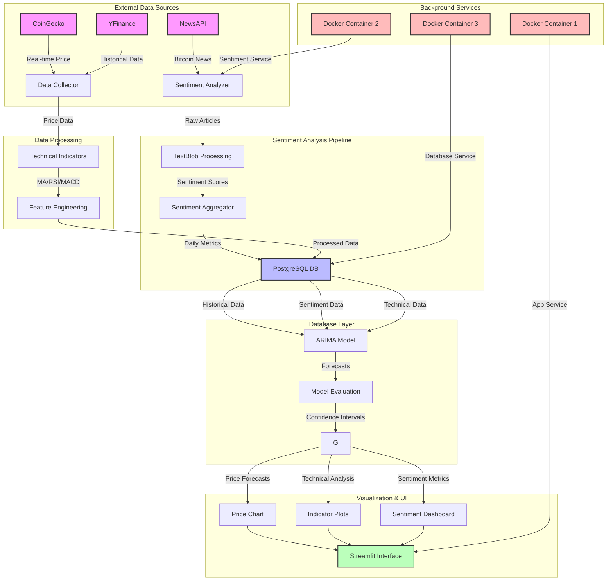

# Bitcoin Price Forecasting System

A comprehensive Bitcoin price forecasting system with advanced time series modeling, sentiment analysis, and interactive visualization.

## Features

- **Real-time Bitcoin Price Tracking**: Fetches latest BTC prices and updates every minute
- **Advanced Forecasting**: ARIMA/SARIMAX time series models with confidence intervals
- **Sentiment Analysis**: Analyzes Bitcoin news sentiment using NewsAPI and TextBlob
- **Technical Indicators**: Moving averages, RSI, MACD, and Bollinger Bands
- **Interactive Dashboard**: Visualize forecasts, technical indicators, and sentiment
- **Docker Containerization**: Complete multi-container setup with PostgreSQL
- **Real-time Updates**: Price and predictions update automatically every minute

## Architecture

The system consists of three main components:

1. **Main Application**: Streamlit web interface with forecasting models
2. **Sentiment Analysis Service**: Continuously analyzes Bitcoin news sentiment
3. **PostgreSQL Database**: Stores historical prices and sentiment data



## Prerequisites

- Docker and Docker Compose
- NewsAPI key (free tier available at [newsapi.org](https://newsapi.org/register))

## Environment Variables

The following environment variables are required:

- `NEWS_API_KEY`: Your NewsAPI key for sentiment analysis
- Database configuration (automatically set up by docker-compose):
  - `DATABASE_URL`: PostgreSQL connection string
  - `PGUSER`, `PGPASSWORD`, `PGHOST`, `PGPORT`, `PGDATABASE`

## Installation

### Using Docker (Recommended)

1. Clone the repository:
   ```bash
   git clone https://github.com/yourusername/bitcoin-price-forecasting.git
   cd bitcoin-price-forecasting
   ```

2. Create a `.env` file with your environment variables:
   ```
   NEWS_API_KEY=your_newsapi_key_here
   PGUSER=postgres
   PGPASSWORD=postgres
   PGDATABASE=bitcoin_forecast
   PGPORT=5432
   PGHOST=db
   UPDATE_INTERVAL_SECONDS=60
   SENTIMENT_UPDATE_INTERVAL=3600
   ```

3. Build and start the containers using the provided scripts:
   ```bash
   # Build Docker images
   ./docker_build.sh
   
   # Run the application
   ./docker_run.sh
   ```

   Alternatively, you can use Docker Compose directly:
   ```bash
   # Build and start all services
   docker-compose up -d

   # To view logs
   docker-compose logs -f

   # To stop all services
   docker-compose down
   ```

4. Access the application at [http://localhost:5001](http://localhost:5001)

5. To stop the application:
   ```bash
   ./docker_stop.sh
   ```

### Manual Installation

1. Clone the repository
2. Install requirements:
   ```bash
   pip install -r requirements.txt
   ```

3. Set up PostgreSQL database
4. Set required environment variables
5. Start the application:
   ```bash
   streamlit run app.py
   ```

## Project Structure

```
├── app.py                   # Main Streamlit application
├── docker-compose.yml       # Docker Compose configuration
├── Dockerfile               # Main application Dockerfile
├── requirements.txt         # Python dependencies
├── .streamlit/              # Streamlit configuration
├── sentiment_analysis/      # Sentiment analysis module
│   ├── sentiment_analyzer.py  # NewsAPI and TextBlob integration
│   ├── Dockerfile           # Sentiment analysis Dockerfile
│   └── requirements.txt     # Sentiment analysis dependencies
└── src/                     # Source code modules
    ├── data_collector.py    # Bitcoin price data collection
    ├── model.py             # Time series forecasting models
    ├── sentiment_integration.py  # Sentiment data integration
    ├── technical_indicators.py   # Technical analysis indicators
    ├── utils.py             # Utility functions
    └── visualizer.py        # Data visualization components
```

## Usage

### Dashboard Navigation

The dashboard consists of the following sections:

1. **Current Price**: Shows real-time BTC price with change indicators
2. **Historical Data**: Displays Bitcoin price history with technical indicators
3. **Forecast**: Predicted prices with confidence intervals
4. **Technical Analysis**: RSI, MACD, and other technical indicators
5. **Sentiment Analysis**: News sentiment metrics and distribution

### Configuration Options

Sidebar controls allow you to:

- Select data source (CoinGecko or YFinance)
- Choose historical data period
- Set forecast horizon (days)
- Adjust confidence level
- Toggle model components
- Select technical indicators to display

## Docker Deployment

The system uses a multi-container Docker setup:

- **app**: Main Streamlit application
- **sentiment-analyzer**: Background service for news sentiment analysis
- **db**: PostgreSQL database for persistent storage

## Development

### Database Setup

The PostgreSQL database is automatically initialized with the required tables when the sentiment analysis service starts:

- `news_articles`: Stores Bitcoin news articles
- `sentiment_analysis`: Sentiment scores for each article
- `aggregate_sentiment`: Daily aggregated sentiment metrics

To manually initialize the database:

```bash
# Using the provided script (recommended)
./db_init.sh

# Or using the sentiment analyzer directly
cd sentiment_analysis
python sentiment_analyzer.py
```

### Utility Scripts

The following utility scripts are included to help with development and deployment:

- `docker_build.sh`: Builds Docker images for the application
- `docker_run.sh`: Starts all containers with proper configuration
- `docker_stop.sh`: Stops all running containers
- `db_init.sh`: Initializes the PostgreSQL database tables

### Running Tests

```bash
pytest
```

## License

This project is licensed under the MIT License - see the LICENSE file for details.

## Acknowledgements

- [Streamlit](https://streamlit.io/) for the interactive web interface
- [NewsAPI](https://newsapi.org/) for Bitcoin news data
- [TextBlob](https://textblob.readthedocs.io/) for sentiment analysis
- [Plotly](https://plotly.com/) for interactive visualizations
- [YFinance](https://pypi.org/project/yfinance/) for price data