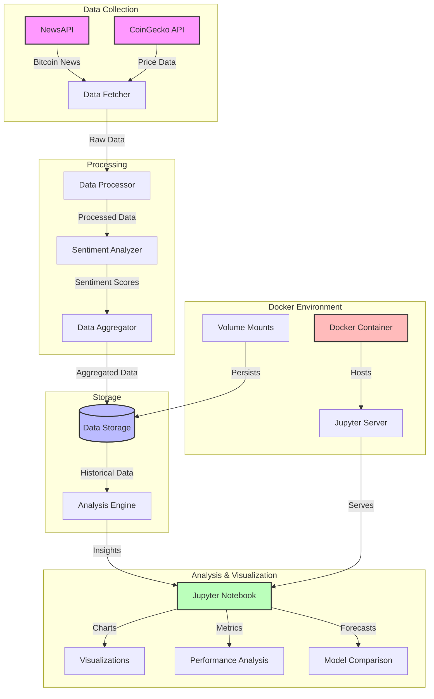

# Bitcoin Sentiment Analysis with Docker

This project implements real-time Bitcoin sentiment analysis using news data and price information. It uses TextBlob for sentiment analysis and integrates with various APIs to gather Bitcoin-related news and price data. The project includes multiple forecasting models (ARIMA, Auto ARIMA, and LSTM) for price prediction.

## Project Overview

The project analyzes Bitcoin-related news articles and price data to:
- Fetch and process Bitcoin news articles
- Perform sentiment analysis on news content using TextBlob
- Track Bitcoin price movements
- Correlate sentiment with price changes
- Generate visualizations and insights
- Compare multiple forecasting models (ARIMA, Auto ARIMA, LSTM)
- Provide both historical analysis and future predictions

## System Architecture



## Prerequisites

- Docker and Docker Compose installed on your system
- NewsAPI key (for fetching news articles)
- Internet connection for API access
- Python 3.9 or higher
- Sufficient disk space for data storage and model training

## Project Structure

```
Notebook/
├── Advanced_BitCoin_Sentiment.ipynb  # Main analysis notebook
├── src/                             # Source code directory
│   ├── common.py                    # Common utilities and API clients
│   ├── fetch_data.py               # Data fetching functions
│   ├── data_saver.py               # Data persistence utilities
│   ├── utils_analyzer.py           # Analysis utilities
│   └── models.py                   # Forecasting models (ARIMA, LSTM)
├── data/                           # Data storage directory
├── logs/                           # Log files directory
├── Dockerfile                      # Docker configuration
├── docker-compose.yml             # Docker Compose configuration
└── requirements.txt               # Python dependencies
```

## Getting Started

1. Clone the repository:
```bash
git clone <repository-url>
cd TutorTask106_Spring2025_Real_Time_Bitcoin_Sentiment_Analysis_Using_TextBlob/Notebook
```

2. Create necessary directories:
```bash
mkdir -p data logs notebook_config
```

3. Create a `.env` file with your API keys:
```bash
echo "NEWS_API_KEY=your_api_key_here" > .env
```

4. Build and start the Docker container:
```bash
docker-compose up --build
```

5. Access the Jupyter notebook:
- Open your browser and navigate to `http://localhost:8888`
- Open `Advanced_BitCoin_Sentiment.ipynb`

## Features

- **Real-time News Analysis**: Fetches and analyzes Bitcoin-related news articles
- **Sentiment Analysis**: Uses TextBlob for sentiment scoring
- **Price Tracking**: Integrates with CoinGecko API for Bitcoin price data
- **Data Visualization**: Generates interactive charts and insights
- **Multiple Forecasting Models**:
  - ARIMA for time series forecasting
  - Auto ARIMA for automated parameter selection
  - LSTM for deep learning-based predictions
- **Model Comparison**: Visual comparison of different forecasting approaches
- **Cached Data Mode**: Supports both real-time and cached data analysis
- **Historical Analysis**: Compare sentiment and price trends over time

## Docker Setup

The project uses a Docker-based setup with the following components:

### Dockerfile
- Python 3.9 base image
- All required dependencies installed
- Jupyter notebook with extensions
- Proper environment configuration

### Docker Compose
- Volume mappings for data persistence
- Environment variable configuration
- Health monitoring
- Automatic container restart

## Usage

1. **Data Collection**:
   - The notebook fetches news articles and price data
   - Data is cached locally for faster subsequent runs

2. **Analysis**:
   - Run cells in sequence to perform analysis
   - Modify parameters in the notebook as needed
   - View generated visualizations and insights

3. **Forecasting**:
   - Compare different forecasting models
   - Adjust forecast parameters as needed
   - View model performance metrics

4. **Data Persistence**:
   - All data is stored in the `data/` directory
   - Logs are maintained in the `logs/` directory

## Environment Variables

- `NEWS_API_KEY`: Your NewsAPI key
- `USE_CACHED_DATA`: Set to 'true' to use cached data
- `PYTHONPATH`: Set to '/app' for proper module imports

## License

This project is licensed under the MIT License - see the LICENSE file for details.

## Acknowledgments

- NewsAPI for news data
- CoinGecko for price data
- TextBlob for sentiment analysis
- Jupyter project for the notebook environment
- Statsmodels for ARIMA implementation
- TensorFlow/Keras for LSTM implementation
